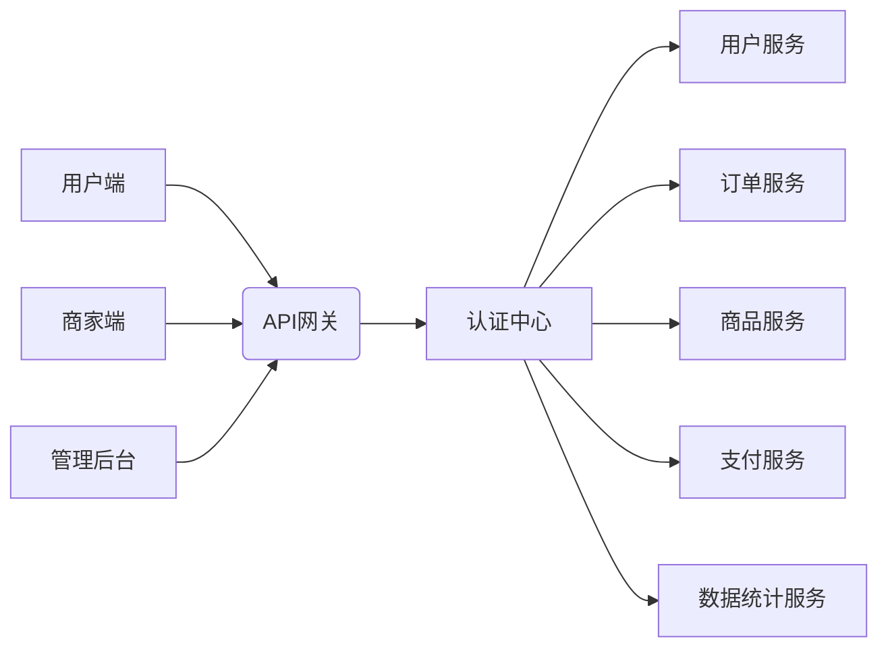

# 苍穹外卖项目 - README

## 项目概述
苍穹外卖是一个基于Spring Boot + Vue的前后端分离外卖订餐系统，专为餐饮企业提供高效的数字化解决方案。项目实现了用户在线点餐、商家运营管理、后台数据监控等全流程功能。

> **项目地址**：https://pip.itcast.cn/java-cqwm

## 技术栈

### 后端技术
- **核心框架**：Spring Boot 2.7
- **数据层**：MyBatis-Plus + MySQL 8.0
- **安全框架**：Spring Security + JWT
- **缓存**：Redis 6.x
- **消息队列**：RabbitMQ
- **接口文档**：Swagger3 + Knife4j
- **其他**：Lombok, Hutool, POI

### 前端技术
- **核心框架**：Vue 3 + TypeScript
- **UI组件**：Element Plus + Vant4
- **状态管理**：Pinia
- **路由**：Vue Router 4
- **构建工具**：Vite 4

### 基础设施
- **容器化**：Docker 20.10+
- **持续集成**：Jenkins
- **部署**：Nginx + Alibaba Cloud

## 系统架构


## 功能模块

### 用户端功能
1. **用户认证**
   - 手机号登录/注册
   - 微信一键登录
   - JWT令牌认证

2. **核心功能**
   - 餐厅/菜品多维度搜索
   - 智能推荐系统
   - 购物车管理
   - 多地址配送管理
   - 订单状态实时追踪

3. **支付系统**
   - 微信支付/模拟支付
   - 订单超时自动取消
   - 退款流程管理

### 商家端功能
1. **商品管理**
   - 菜品/套餐CRUD操作
   - 智能分类管理
   - 库存预警系统

2. **订单管理**
   - 实时订单看板
   - 智能接单/拒单
   - 订单打印系统

3. **数据统计**
   - 销售热力图分析
   - 时段销量分析
   - 客户复购率统计

### 管理后台
1. **全局管理**
   - 多角色权限控制（RBAC）
   - 操作日志审计
   - 系统参数配置

2. **数据分析**
   - 多维度经营报表
   - 实时交易监控
   - 用户行为分析


## 项目结构
```
苍穹外卖
├── cqwm-common          # 公共模块
├── cqwm-core            # 核心业务
├── cqwm-gateway         # API网关
├── cqwm-auth            # 认证中心
├── cqwm-order           # 订单服务
├── cqwm-product         # 商品服务
├── cqwm-statistics      # 数据统计
├── frontend             # 前端项目
│   ├── user-app         # 用户端
│   ├── merchant-app     # 商家端
│   └── admin-app        # 管理后台
└── sql                  # 数据库脚本
```

## 特色功能
1. **智能推荐引擎**
   - 基于用户行为的协同过滤算法
   - 实时更新推荐列表

2. **分布式事务解决方案**
   - 订单创建 -> 扣减库存 -> 支付 的Saga模式
   - 基于RabbitMQ的最终一致性

3. **高并发优化**
   - Redis缓存热点数据
   - 订单分库分表设计
   - 限流熔断机制

4. **实时数据大屏**
   - 基于ECharts的可视化展示
   - 分钟级数据刷新

## 学习资源
1. [项目文档中心](https://docs.itcast.cn/java-cqwm)
2. [视频教程](https://edu.itcast.cn/course-java-cqwm)
3. [常见问题解答](https://qa.itcast.cn/tag/cqwm)

